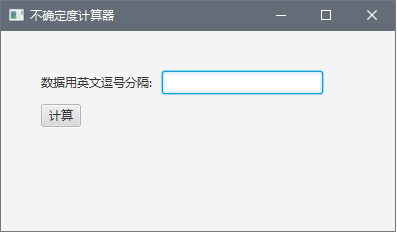
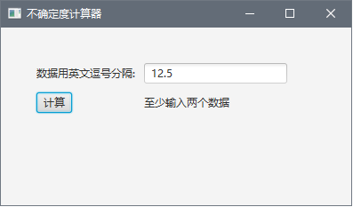
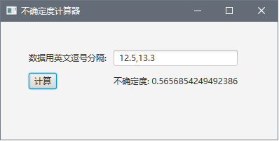

# uncertainty-calculator
一个不确定度计算器。用户可以输入多个测量值，程序会计算并输出这些测量值的不确定度。当测量值少于两个时，程序提示错误并阻止计算过程。
## 运行环境
Java 8或更高版本
## 算法步骤
1.	用户点击按钮时触发计算过程。读取用户输入的测量值，解析为数组列表，并调用不确定度计算器来计算不确定度。
2.	不确定度计算器接受一组数字，然后计算这些数字的平均值、方差和标准差，最终输出不确定度。
## 使用示例
- 运行项目后出现如下界面：  
   
- 输入数据少于两个或格式错误时：  
   
- 正确输入数据并点击计算后：  
   

## 项目特点
1.	可扩展的测量值解析：项目中使用了一个parseMeasurements方法来解析用户输入的测量值，并将其转换为数字列表。这个解析方法可以根据需要进行扩展，例如支持科学记数法、百分比等更复杂的测量值格式。
2.	异常处理和错误提示：项目中使用了异常处理机制来处理用户错误输入。当用户输入的测量值数量不足或格式不正确时，会抛出IllegalArgumentException异常，并显示相应的错误信息。这种错误处理机制可以进一步扩展，例如添加更多的错误类型和自定义错误消息。
3.	项目中使用了Java FX框架来创建GUI界面，通过按钮和标签等控件与用户进行交互。可以进一步拓展界面设计，例如添加更多的功能按钮、图表展示等，以提升用户体验和可用性。

